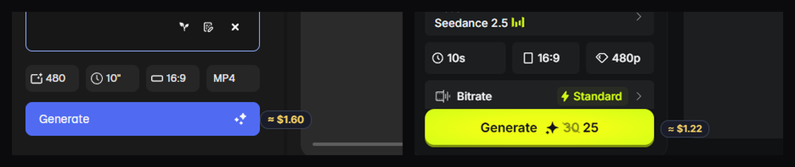
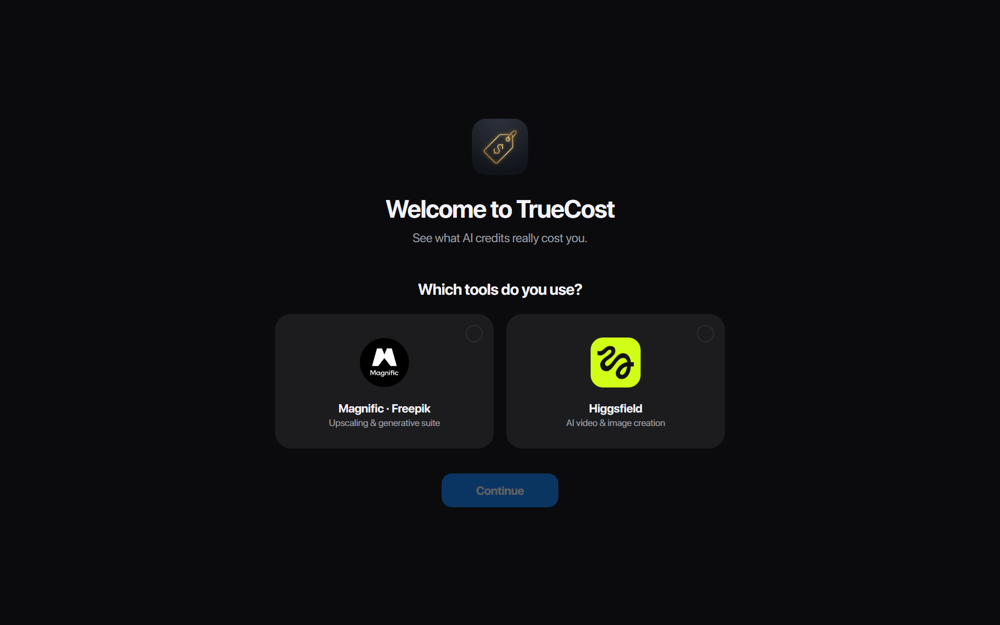
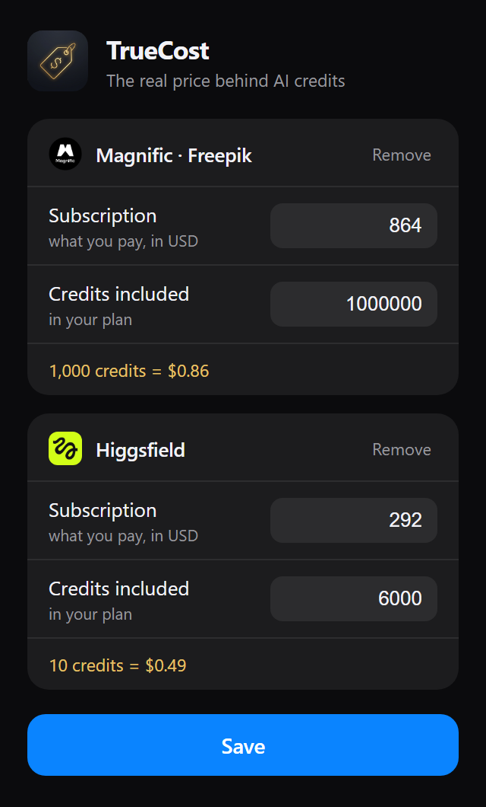

<p align="center">
  
</p>

<h1 align="center">TrueCost</h1>

<p align="center"><b>See the real dollar price behind AI credits.</b></p>

<p align="center">
  
  
  
</p>

---

AI creative platforms sell you *credits* — but nobody thinks in credits. TrueCost shows the
actual USD price next to every credit cost on [Magnific](https://www.magnific.com) /
[Freepik](https://www.freepik.com) and [Higgsfield](https://higgsfield.ai), computed from
**your own plan** (what you pay ÷ credits you get).

<p align="center">
  
</p>

<p align="center"><i>Same clip, two platforms — TrueCost makes the difference visible.</i></p>

No servers, no tracking, no accounts. Everything runs locally in your browser.

## Features

- 💰 **Live price pills** next to credit costs — always visible, update automatically as you
  change duration, quality or model
- 🚀 **First-run onboarding** — pick the tools you use, enter your plan, done
- ⚙️ **Your plan, your prices** — subscription cost and included credits per service;
  open tabs update instantly on save
- ➕ **Adaptive popup** — shows only your services, one-click *Add* for the others
- 🔒 **Private by design** — the only stored data is your plan numbers (browser
  `storage.sync`); nothing ever leaves your machine

<table align="center">
  <tr>
    <th>First-run onboarding</th>
    <th>Configure your plans</th>
  </tr>
  <tr>
    <td valign="top"></td>
    <td valign="top"></td>
  </tr>
</table>

### Supported sites

| Service | Detection |
|---|---|
| Magnific / Freepik | credits sprite icon next to the cost number |
| Higgsfield | Generate buttons — reads the effective (discounted) price, ignores the crossed-out one |
| All | plain "1680 credits" text (pricing pages, tooltips) |

## Install

### Chrome / Edge / Brave / Opera (any Chromium browser)

**From source (until store release):**
1. Download or clone this repo
2. Open `chrome://extensions` (or `edge://extensions`)
3. Enable **Developer mode**
4. Click **Load unpacked** → select the repo folder
5. The onboarding page opens — pick your tools and you're set

### Firefox

1. Run the build (see below) to produce `dist/truecost-firefox.zip`
2. `about:debugging` → **This Firefox** → **Load Temporary Add-on** → pick the zip
   (permanent install requires signing through [AMO](https://addons.mozilla.org))

## Configure

Click the TrueCost icon in the toolbar:

- **Subscription** — what you pay for your plan, in USD
- **Credits included** — how many credits that plan gives you

The golden line shows your effective rate live while typing. Use **+ Add** to enable
another service later, **Remove** to hide one.

## Build (store packages)

```powershell
# Windows
./build.ps1
```
```bash
# macOS / Linux
./build.sh
```

Produces `dist/truecost-chrome.zip` (Chrome Web Store, Edge Add-ons) and
`dist/truecost-firefox.zip` (AMO, with its own manifest).

## How it works

A single content script scans the page for credit costs using per-site strategies
(sprite-icon matching on Magnific, last-numeric-text-node on Higgsfield Generate buttons,
plus a generic "N credits" text matcher). Price pills are drawn on a fixed overlay layer in
`<body>` — never inside the site's React tree — so SPA re-renders can't wipe them. A
debounced `MutationObserver` plus scroll/resize listeners and a 1.2s safety interval keep
pills positioned and up to date. Pills are rendered only for services you enabled.

## Privacy

See [PRIVACY.md](PRIVACY.md). Short version: TrueCost collects nothing, phones nowhere,
and stores only the plan numbers you type, in your browser's own extension storage.

## Contributing

Adding a service = one detection function in `content.js`, one entry in `TC_DEFAULTS` /
`TC_META` (`shared.js`), and a logo in `assets/`. PRs welcome.

## License

[MIT](LICENSE)
